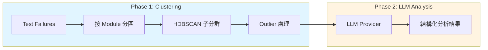

# AI Analysis Engine

GMS-Helper 使用機器學習分群與 LLM 分析來處理 CTS/GMS 測試失敗。

---

## 架構總覽



---

## Part 1: 分群引擎

### 演算法: Module-First Hierarchical HDBSCAN

採用 **兩階段策略**：

| 階段 | 方法 | 目的 |
|:---|:---|:---|
| **Phase 1** | 按 `module_name` 硬分區 | 確保不同模組的 failure 永遠不會混合（Purity = 100%） |
| **Phase 2** | HDBSCAN 子分群 | 在同一模組內發現相似 failure 群 |

```python
for module, group_failures in module_groups.items():
    local_labels = self._cluster_core(group_failures)  # HDBSCAN
    local_labels = self.handle_outliers(group_failures, local_labels)
    local_labels = self.merge_small_clusters(group_failures, local_labels)
```

---

### 特徵工程

#### TF-IDF 向量化參數

| 參數 | 值 | 說明 |
|:---|:---|:---|
| `ngram_range` | (1, 2) | Unigrams + bigrams 捕捉上下文 |
| `max_features` | 2000 | 限制詞彙表大小 |
| `sublinear_tf` | True | 使用 `1 + log(tf)` 抑制高頻詞 |
| `stop_words` | 擴展 | 包含 `java`, `junit`, `android` 等 domain-specific 詞 |

#### 提取的特徵

| Feature | 提取方法 | 權重 |
|:---|:---|:---|
| **Class Name** | Fully qualified name 最後一段 | ×2 |
| **Method Name** | 直接取 `method_name` | ×1 |
| **Exception Type** | Regex 匹配 `*Error`/`*Exception` | ×2（非 generic 時） |
| **Assertion Message** | 匹配 `expected:<...> but was:<...>` | ×1 |
| **Top 3 Frames** | Stack trace 前 3 行 `at ...` | ×1 |

#### Framework Frame 過濾

以下 pattern 會被移除（無區分性）：

```python
FRAMEWORK_PATTERNS = [
    r'org\.junit\.Assert\.',
    r'org\.junit\.internal\.',
    r'android\.test\.',
    r'androidx\.test\.',
    r'java\.lang\.reflect\.',
    r'dalvik\.system\.',
]
```

#### Generic Exception 降權

以下 exception 不參與加權（出現頻率高，不具區分性）：

```python
GENERIC_EXCEPTIONS = {
    'assertionerror', 'runtimeexception', 'exception',
    'throwable', 'error', 'testfailure'
}
```

---

### HDBSCAN 參數

```python
HDBSCAN(
    min_cluster_size=2,
    min_samples=1,
    metric='euclidean',
    cluster_selection_method='eom'
)
```

| 參數 | 值 | 設計考量 |
|:---|:---|:---|
| `min_cluster_size` | 2 | 針對小樣本場景，允許 2 個 failure 成群 |
| `min_samples` | 1 | 激進設定，減少 outlier 產生 |
| `metric` | euclidean | SVD 降維後使用，高維稀疏時考慮改用 `cosine` |
| `cluster_selection_method` | eom | Excess of Mass，傾向選擇較大穩定的 cluster |

> **Note**: EOM vs LEAF — EOM 產生較少但較穩定的 cluster，LEAF 會產生更多細粒度 cluster。

---

### 降維 (Conditional)

| 條件 | 行為 |
|:---|:---|
| 樣本數 < 50 | **關閉 SVD**（小樣本降維反而損害效果） |
| 樣本數 ≥ 50 且維度 > 100 | 使用 `TruncatedSVD(n_components=100)` |

---

### 後處理

| 步驟 | 作用 |
|:---|:---|
| `handle_outliers()` | HDBSCAN label=-1 的 outlier fallback 到以 module 為基礎的 cluster |
| `merge_small_clusters()` | 同 module+class 的小 cluster (≤2) 合併，減少碎片化 |

---

### 已知限制

| 限制 | 說明 |
|:---|:---|
| 小樣本表現 | N < 10 時 HDBSCAN 難以形成有意義的 cluster |
| Euclidean + 高維稀疏 | 未降維時距離趨向等距，需依賴 SVD |
| Silhouette 偏低 | 實測約 0.05-0.3，text clustering 本質難以達到高值 |

---

## Part 2: LLM 分析

### 支援的 Provider

| Provider | Class | 適用場景 |
|:---|:---|:---|
| **OpenAI** | `OpenAILLMClient` | 外網環境，使用 `gpt-4o-mini` |
| **Internal** | `InternalLLMClient` | 內網 Ollama/vLLM 伺服器 |
| **Cambrian** | `CambrianLLMClient` | 內網 Cambrian gateway（SSL 驗證關閉） |
| **Mock** | `MockLLMClient` | Fallback / 測試用 |

### Provider 選擇邏輯

```python
def get_llm_client():
    provider = setting.llm_provider  # 'openai' | 'internal' | 'cambrian'
    
    if provider == 'cambrian':
        return CambrianLLMClient(url, token, model)
    elif provider == 'internal':
        return InternalLLMClient(url, model)
    elif provider == 'openai':
        return OpenAILLMClient(api_key)
    else:
        return MockLLMClient()
```

---

### System Prompt

```text
You are an expert Android GMS certification test engineer. 
Analyze test failures and provide actionable insights.

Return JSON with:
- title: Max 20 words summary
- summary: Detailed technical summary
- root_cause: Why the test failed (numbered list if multiple)
- solution: Numbered steps to fix (newline separated)
- severity: High | Medium | Low
- category: Test Case Issue | Framework Issue | Media/Codec Issue | 
           Permission Issue | Configuration Issue | Hardware Issue | 
           Performance Issue | System Stability
- confidence_score: 1-5 based on evidence strength
- suggested_assignment: Team owner
```

### Confidence Score 定義

| Score | 證據強度 | 範例 |
|:---|:---|:---|
| **5** | Code-level pinpoint | Stack trace 明確指向 driver/kernel 或特定 race condition |
| **4** | Framework/Service error | WiFiService、AudioService 等明確 service 錯誤 |
| **3** | Generic assertion failure | `expected true but was false`（**大多數 case 的 baseline**） |
| **2** | Vague guess | 只有 generic error message，無 useful trace |
| **1** | Wild guess | 無 log、只有 timeout 或空 failure |

---

### 錯誤處理

LLM 呼叫失敗時返回 fallback：

```python
{
    "root_cause": "AI Analysis Failed",
    "solution": f"Error: {str(e)}",
    "severity": "Low",
    "confidence_score": 1
}
```

---

## 品質指標

| 指標 | 說明 | 備註 |
|:---|:---|:---|
| **Purity** | 單一 module 的 cluster 比例 | 由 Module-first 設計保證 = 100% |
| **Outlier Ratio** | 未分群的 failure 比例 | 目標 < 5%，由 `handle_outliers()` 處理 |
| **Silhouette Score** | 群內凝聚度 vs 群間分離度 | Text clustering 典型值 0.1-0.3 |

---

## 檔案位置

| 功能 | 檔案 |
|:---|:---|
| 分群引擎 | [clustering.py](file:///Users/chenzeming/dev/GMS-helper/backend/analysis/clustering.py) |
| LLM Client | [llm_client.py](file:///Users/chenzeming/dev/GMS-helper/backend/analysis/llm_client.py) |
| Dedup Service | [deduplication_service.py](file:///Users/chenzeming/dev/GMS-helper/backend/integrations/deduplication_service.py) |
