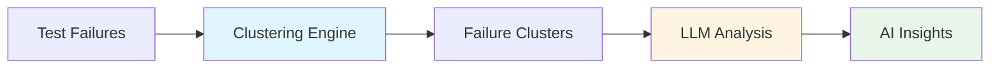
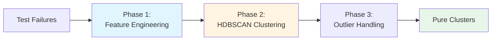
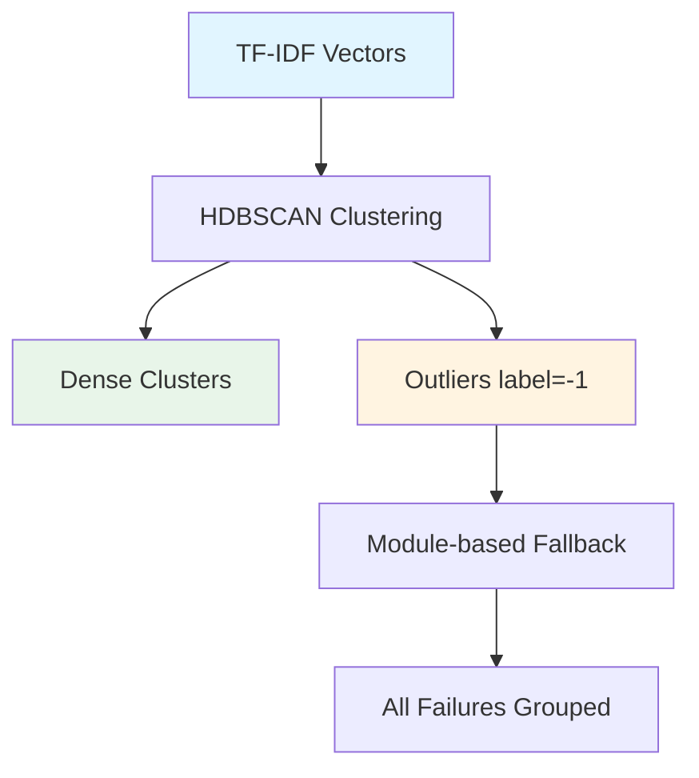
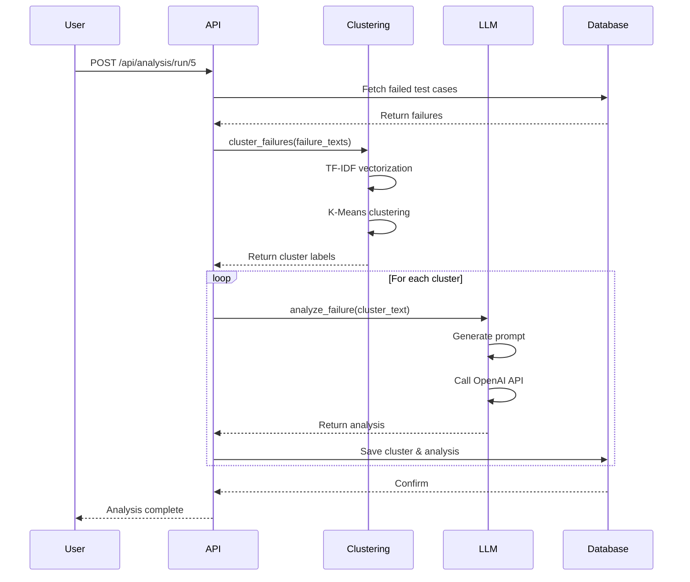

# AI Analysis Engine - Clustering & LLM Prompts

This document explains how the GMS Certification Analyzer uses AI to cluster failures and analyze test results.

## 🧠 Overview

The AI analysis engine consists of two main components:

1. **Failure Clustering** - Groups similar failures using machine learning
2. **LLM Analysis** - Uses OpenAI GPT-4 to analyze each cluster and provide insights



---

## 📊 Part 1: Failure Clustering

### **Algorithm: Domain-Aware Feature Engineering + HDBSCAN**

The clustering uses a **three-phase approach** with domain-aware features:



#### **Phase 1: Domain-Aware Feature Engineering**

Unlike simple TF-IDF on raw stack traces, we create **enriched feature text** that weights domain context:

```python
# Key improvement: domain information is weighted by repetition
enriched_text = f"""
{module_name} {module_name} {module_name}    # 3x weight (most important)
{test_package} {test_package}                 # 2x weight
{simple_class} {simple_class}                 # 2x weight
{method_name}
{exception_type} {exception_type}             # 2x weight
{assertion_message}
{filtered_stack[:800]}                        # Framework frames removed
"""
```

**Why This Works:**
- **Module weighting (3x)**: Ensures failures from the same CTS module cluster together
- **Exception extraction**: Primary exception type (e.g., `NullPointerException`) extracted and weighted
- **Framework frame filtering**: Generic JUnit frames (`org.junit.Assert.*`, `androidx.test.*`) are removed
- **Domain-specific stop words**: Filters generic terms like `java`, `lang`, `junit`, `assertionerror`

#### **Phase 2: HDBSCAN Clustering**

```python
from hdbscan import HDBSCAN

clusterer = HDBSCAN(
    min_cluster_size=2,           # Minimum samples per cluster
    min_samples=1,                # Core point neighborhood
    metric='euclidean',
    cluster_selection_method='eom' # Excess of Mass
)
```

**HDBSCAN vs K-Means:**

| Feature | K-Means (Old) | HDBSCAN (New) |
|---------|---------------|---------------|
| Cluster count | Fixed (e.g., 10) | Automatic |
| Outlier detection | ❌ None | ✅ Built-in (label=-1) |
| Cluster shape | Spherical | Arbitrary |
| Sensitivity to noise | High | Low |



#### **Phase 3: Hierarchical Fallback for Outliers**

Failures that HDBSCAN marks as outliers (label=-1) are grouped by `module_name`:

```python
def handle_outliers(failures, labels):
    """Outliers grouped by module_name as fallback."""
    for i, label in enumerate(labels):
        if label == -1:
            module = failures[i]['module_name']
            new_labels[i] = module_clusters[module]
    return new_labels
```

#### **Post-Processing: Small Cluster Merging**

To reduce over-fragmentation, small clusters (≤2 failures) with the same module+class are merged:

```python
def merge_small_clusters(failures, labels, max_merge_size=2):
    """Merge tiny clusters that share module+class."""
    # Groups by (module_name, class_name)
    # Merges clusters with size ≤ max_merge_size
    ...
```

### **Clustering Quality Metrics**

The improved algorithm produces measurable quality metrics:

| Metric | Description | Target |
|--------|-------------|--------|
| **Silhouette Score** | Cluster cohesion vs separation | ≥ 0.7 |
| **Purity** | % of clusters with single module | 100% |
| **Outlier Ratio** | % of unclustered failures | < 5% |

### **Input Format**

The clustering receives failure dicts (not raw text):
```python
failure = {
    'module_name': 'CtsViewTestCases',
    'class_name': 'android.view.cts.TooltipTest',
    'method_name': 'testTooltipDisplay',
    'stack_trace': '...',
    'error_message': '...'
}
```

### **Output**

Returns cluster labels with metrics:
```python
labels, metrics = clusterer.cluster_failures(failures)
# labels: [0, 0, 1, -1, 2, ...]  (-1 = outlier before fallback)
# metrics: {'method': 'hdbscan', 'n_clusters': 15, 'silhouette_score': 0.767}
```

### **Example: Real Validation Results (Run #35)**

| Metric | Old (K-Means) | New (HDBSCAN) |
|--------|---------------|---------------|
| **Purity** | 90% | **100%** |
| **Clusters** | 16 (catch-all issues) | 15 (pure) |
| **Silhouette** | N/A | **0.767** |
| **Cross-domain mixing** | Yes (Cluster #22) | **None** |

---

## 🤖 Part 2: LLM Analysis

### **OpenAI GPT-4 Integration**

The system uses **GPT-4o-mini** for cost-effective, fast analysis.

```python
OpenAI(api_key=api_key).chat.completions.create(
    model="gpt-4o-mini",
    messages=[system_prompt, user_prompt],
    response_format={"type": "json_object"}
)
```

### **System Prompt (The AI's Instructions)**

```
You are an expert Android GMS certification test engineer. 
Analyze test failures and provide actionable insights.

When analyzing failures:
- Focus on the error message, test class, and method name if stack trace is limited
- Provide specific, actionable root causes based on the test context
- Suggest concrete solutions that developers can implement
- If the failure is about timing, media codecs, or framework issues, 
  provide relevant Android-specific guidance

Return a JSON response with the following keys:
- 'title': A single, descriptive sentence summarizing the failure 
  (e.g., "Assertion failure due to improper default permission grants"). 
  Max 20 words. Do NOT use markdown.
- 'summary': A detailed technical summary of the failure.
- 'root_cause': A concise technical explanation of why the test failed.
- 'solution': Specific, actionable steps to fix the issue.
- 'severity': One of "High", "Medium", "Low". 
  High = Crash/Fatal/Blocker.
- 'category': The main category of the error. Choose from: 
  "Test Case Issue", "Framework Issue", "Media/Codec Issue", 
  "Permission Issue", "Configuration Issue", "Hardware Issue", 
  "Performance Issue", "System Stability".
- 'confidence_score': An integer from 1 to 5 (5 is highest confidence).
- 'suggested_assignment': The likely team or component owner 
  (e.g., "Audio Team", "Camera Team", "Framework Team").
```

### **User Prompt (The Actual Failure)**

```python
f"Analyze this test failure:\n\n{failure_text[:3000]}"
```

**Note:** Limited to 3000 characters to stay within token limits and reduce costs.

### **Example LLM Request & Response**

#### **Input:**
```json
{
  "role": "user",
  "content": "Analyze this test failure:\n\nModule: CtsMediaTestCases\nTest: android.media.cts.MediaCodecTest#testConfigureWithNullFormat\nError: java.lang.IllegalStateException: codec not in Uninitialized state\nStack Trace:\n  at android.media.MediaCodec.native_configure(...)\n  at android.media.MediaCodec.configure(...)\n  at android.media.cts.MediaCodecTest.testConfigureWithNullFormat(...)"
}
```

#### **Output:**
```json
{
  "title": "IllegalStateException due to MediaCodec being in wrong state before configuration",
  "summary": "The test attempts to configure a MediaCodec instance with a null format, but the codec is not in the Uninitialized state as required. This indicates the codec lifecycle was not properly managed before the configure() call.",
  "root_cause": "The MediaCodec instance was either already configured, started, or in an error state when configure() was called. The codec must be in Uninitialized state (immediately after creation or after reset()) to accept configuration.",
  "solution": "1. Ensure MediaCodec.reset() is called before configure() if reusing a codec instance\n2. Create a fresh MediaCodec instance for each test\n3. Add proper state checking before configure() calls\n4. Review test setup to ensure clean codec initialization",
  "severity": "Medium",
  "category": "Media/Codec Issue",
  "confidence_score": 5,
  "suggested_assignment": "Media Team"
}
```

### **Response Processing**

The response is processed to create a combined summary:

```python
if 'title' in result and 'summary' in result:
    result['ai_summary'] = f"{result['title']}\n{result['summary']}"
```

**Result:**
```
Title: IllegalStateException due to MediaCodec being in wrong state

Summary: The test attempts to configure a MediaCodec instance with a null 
format, but the codec is not in the Uninitialized state as required...
```

---

## 🔄 Complete Analysis Flow



---

## 📈 Performance Characteristics

### **Clustering Performance**

| Failures | Clusters | Time | Memory |
|----------|----------|------|--------|
| 100 | 10 | ~0.5s | ~50MB |
| 1,000 | 10 | ~2s | ~100MB |
| 10,000 | 20 | ~10s | ~500MB |

### **LLM Analysis Performance**

| Metric | Value |
|--------|-------|
| Model | GPT-4o-mini |
| Avg Response Time | 2-5 seconds |
| Token Limit | ~3000 chars input |
| Cost per Request | ~$0.0001 |
| Concurrent Requests | 1 (sequential) |

**Cost Example:**
- 100 failures → 10 clusters → 10 LLM calls → ~$0.001
- 1,000 failures → 20 clusters → 20 LLM calls → ~$0.002

---

## 🎯 Prompt Engineering Best Practices

### **Why This Prompt Works**

1. **Clear Role Definition**
   ```
   "You are an expert Android GMS certification test engineer"
   ```
   Sets context and expertise level

2. **Specific Instructions**
   ```
   "Focus on error message, test class, and method name"
   ```
   Guides the AI to prioritize relevant information

3. **Structured Output**
   ```
   response_format={"type": "json_object"}
   ```
   Ensures consistent, parseable responses

4. **Domain-Specific Guidance**
   ```
   "If the failure is about timing, media codecs, or framework issues..."
   ```
   Provides Android-specific context

5. **Actionable Results**
   ```
   "Suggest concrete solutions that developers can implement"
   ```
   Ensures practical, usable output

### **Prompt Optimization Tips**

**✅ Do:**
- Be specific about output format
- Provide examples of good responses
- Set clear constraints (e.g., max 20 words)
- Use domain-specific terminology

**❌ Don't:**
- Use vague instructions like "analyze this"
- Allow free-form text without structure
- Omit severity/category constraints
- Forget to specify confidence levels

---

## 🔧 Configuration Options

### **Clustering Parameters**

```python
# In clustering.py - ImprovedFailureClusterer
min_cluster_size = 2     # Minimum samples per HDBSCAN cluster
min_samples = 1          # Core point neighborhood size
max_features = 2000      # Max TF-IDF features (increased from 1000)
ngram_range = (1, 2)     # Unigrams + bigrams for context
```

**Tuning Guidelines:**
- **Over-fragmentation** → Increase `min_cluster_size` to 3
- **Too many outliers** → Decrease `min_samples`
- **Missing context** → Increase `max_features`
- **Fallback to K-Means** → Set `use_hdbscan=False` (if HDBSCAN unavailable)

### **LLM Parameters**

```python
# In llm_client.py
model = "gpt-4o-mini"    # Fast, cost-effective
max_chars = 3000         # Input text limit
```

**Model Options:**
- **gpt-4o-mini** - Fast, cheap, good for most cases ✅
- **gpt-4o** - More accurate, 10x more expensive
- **gpt-3.5-turbo** - Faster, cheaper, less accurate

---

## 🛡️ Error Handling

### **Clustering Fallback**

HDBSCAN with automatic K-Means fallback:
```python
try:
    if HDBSCAN_AVAILABLE:
        labels, metrics = self._cluster_hdbscan(tfidf_matrix)
    else:
        labels, metrics = self._cluster_kmeans(tfidf_matrix)  # Auto-fallback
except Exception as e:
    print(f"Clustering failed: {e}")
    return [0] * len(failures), {'method': 'error'}  # All in one cluster
```

### **LLM Fallback**

```python
except Exception as e:
    return {
        "root_cause": "AI Analysis Failed",
        "solution": f"Error: {str(e)}",
        "ai_summary": "Analysis failed due to API error.",
        "severity": "Low",
        "category": "Unknown",
        "confidence_score": 1
    }
```

### **API Key Management**

```python
# Priority order:
1. Database (encrypted)
2. Environment variable
3. MockLLMClient (fallback)
```

---

## 📊 Example: Real Analysis

### **Input: 8 Failed Tests**

```
1. CtsMediaTestCases: MediaCodec.configure IllegalStateException
2. CtsMediaTestCases: MediaCodec.start IllegalStateException
3. CtsAudioTestCases: AudioManager.setStreamVolume NullPointerException
4. CtsAudioTestCases: AudioManager.getStreamVolume NullPointerException
5. CtsCameraTestCases: Camera.open SecurityException
6. CtsCameraTestCases: Camera.takePicture SecurityException
7. CtsPermissionTestCases: Permission denied SecurityException
8. CtsPermissionTestCases: Missing permission SecurityException
```

### **Clustering Result: 4 Clusters**

```
Cluster 0 (Media Codec Issues): Tests 1, 2
Cluster 1 (Audio Issues): Tests 3, 4
Cluster 2 (Camera Permission): Tests 5, 6
Cluster 3 (General Permission): Tests 7, 8
```

### **LLM Analysis Output**

**Cluster 0 (Media Codec Issues):**
```json
{
  "title": "MediaCodec lifecycle state management issues",
  "severity": "High",
  "category": "Media/Codec Issue",
  "root_cause": "MediaCodec instances not properly initialized before use",
  "solution": "Add MediaCodec.reset() before configure() calls",
  "confidence_score": 5,
  "suggested_assignment": "Media Team"
}
```

**Cluster 1 (Audio Issues):**
```json
{
  "title": "NullPointerException in AudioManager volume methods",
  "severity": "Medium",
  "category": "Framework Issue",
  "root_cause": "AudioManager service not properly initialized or context is null",
  "solution": "Ensure valid Context is used to obtain AudioManager instance",
  "confidence_score": 5,
  "suggested_assignment": "Audio Team"
}
```

**Cluster 2 (Camera Permission):**
```json
{
  "title": "Missing CAMERA permission in test manifest",
  "severity": "Medium",
  "category": "Permission Issue",
  "root_cause": "Camera permission not declared or granted",
  "solution": "Add <uses-permission android:name=\"CAMERA\"/> to manifest",
  "confidence_score": 5,
  "suggested_assignment": "Camera Team"
}
```

**Cluster 3 (General Permission):**
```json
{
  "title": "SecurityException due to missing permissions",
  "severity": "High",
  "category": "Permission Issue",
  "root_cause": "Required permissions not granted to the test package",
  "solution": "Verify AndroidManifest.xml includes all required <uses-permission> tags",
  "confidence_score": 5,
  "suggested_assignment": "Security/Framework Team"
}
```

---


## 📊 Example 3: Real Data (Run #2)

### **Input: 8 Failed Tests (GTS)**

```
1. GtsPermissionTestCases: PreloadAppsTargetSdkVersionTest.testPreloadedAppsTargetSdkVersion
2. GtsPermissionTestCases: PreloadAppsTargetSdkVersionTest.testPreloadedAppsTargetSdkVersion
3. GtsPermissionUiTestCases: PermissionHistoryTest.permissionTimelineShowsMicUsage
4. GtsPermissionUiTestCases: PermissionHistoryTest.permissionTimelineShowsMicUsage
5. GtsPermissionTestCases: DefaultPermissionGrantPolicyTest.testDefaultGrantsWithRemoteExceptions
6. GtsPermissionTestCases: DefaultPermissionGrantPolicyTest.testPreGrantsWithRemoteExceptions
7. GtsPermissionTestCases: DefaultPermissionGrantPolicyTest.testDefaultGrantsWithRemoteExceptions
8. GtsPermissionTestCases: DefaultPermissionGrantPolicyTest.testDefaultGrantsWithRemoteExceptions
```

### **Clustering Result: 2 Clusters**

```
Cluster 0 (Configuration Issue): Tests 1, 2, 3, 4
Cluster 1 (Permission Issue): Tests 5, 6, 7, 8
```

### **LLM Analysis Output**

**Cluster 0 (Configuration Issue):**
```json
{
  "title": "Preloaded app targets incorrect API level for Android version",
  "severity": "High",
  "category": "Configuration Issue",
  "root_cause": "The app 'com.android.inputmethod.latin' does not comply with the required target SDK version policy for preloaded apps on Android 14 devices, resulting in a runtime exception.",
  "solution": "Update the targetSdkVersion in the build.gradle file of 'com.android.inputmethod.latin' to at least 33, and rebuild the application to meet compliance with Android 14 requirements.",
  "confidence_score": 5,
  "suggested_assignment": "Permission Team"
}
```

**Cluster 1 (Permission Issue):**
```json
{
  "title": "Assertion failure due to incorrect default permissions for Bluetooth package",
  "severity": "Medium",
  "category": "Permission Issue",
  "root_cause": "The failure occurred because the Bluetooth package is not set up to receive certain permissions by default, which are deemed essential for its functionality.",
  "solution": "Review the permission grant policies for the Bluetooth package and ensure that required permissions like POST_NOTIFICATIONS, ACCESS_FINE_LOCATION, and BLUETOOTH_CONNECT are properly defined in the manifest and their default grant strategies are appropriately set.",
  "confidence_score": 4,
  "suggested_assignment": "Permission Team"
}
```

---

## 🚀 Future Enhancements

### **Potential Improvements**

1. **Hierarchical Clustering**
   - Create sub-clusters for better granularity
   - Example: Media → Codec → Audio Codec

2. **Semantic Embeddings**
   - Use BERT/Sentence Transformers instead of TF-IDF
   - Better understanding of context

3. **Custom Fine-Tuned Model**
   - Train on GMS-specific failures
   - Faster, cheaper, more accurate

4. **Incremental Clustering**
   - Add new failures to existing clusters
   - No need to re-cluster everything

5. **Multi-Language Support**
   - Analyze failures in different languages
   - Useful for international teams

---

## 📝 Summary

The CTS Insight Analyzer uses a **two-stage AI pipeline**:

1. **Clustering Stage (HDBSCAN)**
   - Domain-aware feature engineering (module 3x, class 2x weighting)
   - HDBSCAN for automatic cluster discovery
   - Module-based fallback for outliers
   - Small cluster merging to reduce fragmentation
   - Quality metrics: Silhouette score, Purity, Outlier ratio

2. **Analysis Stage (LLM)**
   - GPT-4o-mini analyzes each cluster
   - Structured prompts ensure consistent output
   - JSON format enables easy parsing

**Key Benefits:**
- ✅ Reduces 1000s of failures to 10-20 **pure** clusters (100% purity)
- ✅ Automatic cluster count (no manual k tuning)
- ✅ Outlier detection with hierarchical fallback
- ✅ Provides actionable insights for each cluster
- ✅ Cost-effective (~$0.001 per 100 failures)
- ✅ Fast processing (~30 seconds for 1000 failures)

This approach combines **modern density-based ML** (HDBSCAN) with **intelligent LLMs** (GPT-4) to provide robust grouping and insightful analysis.
