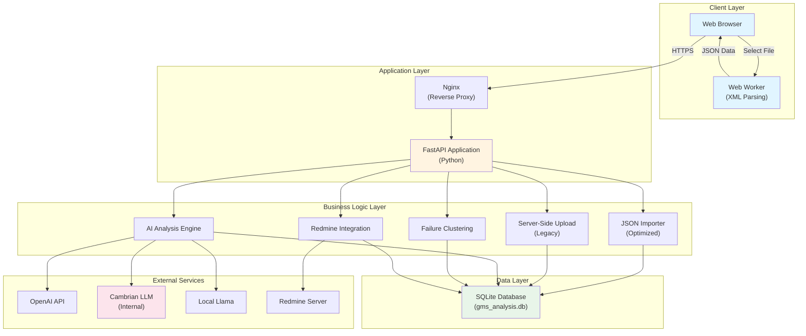
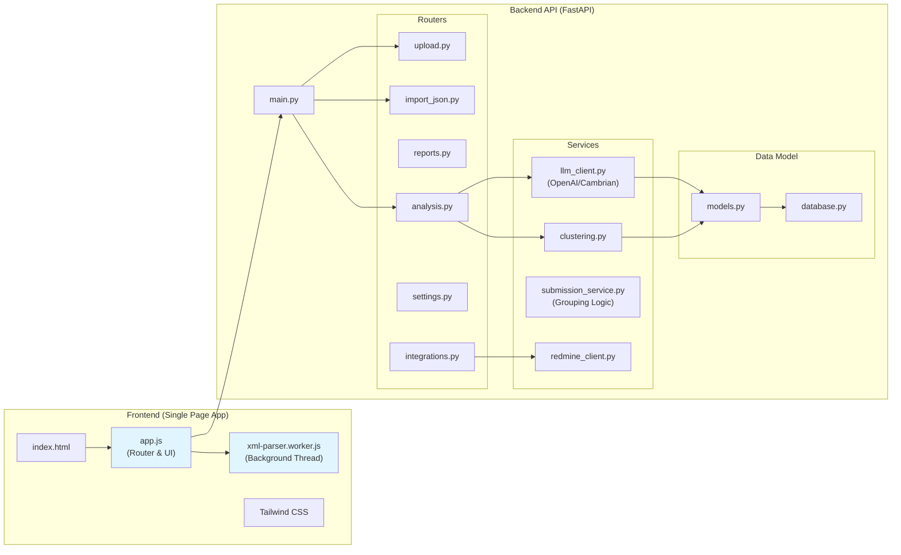
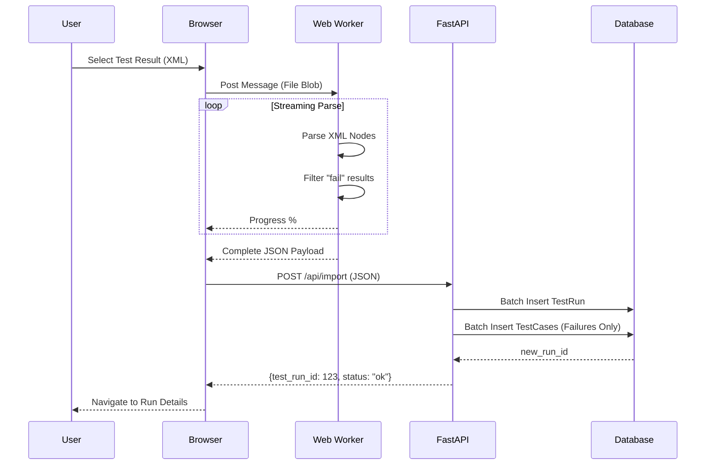
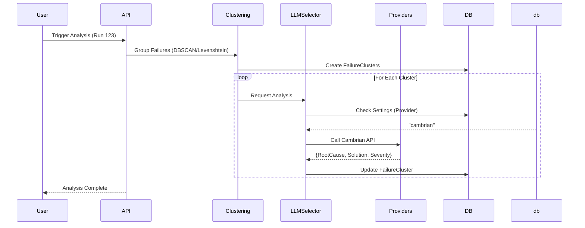
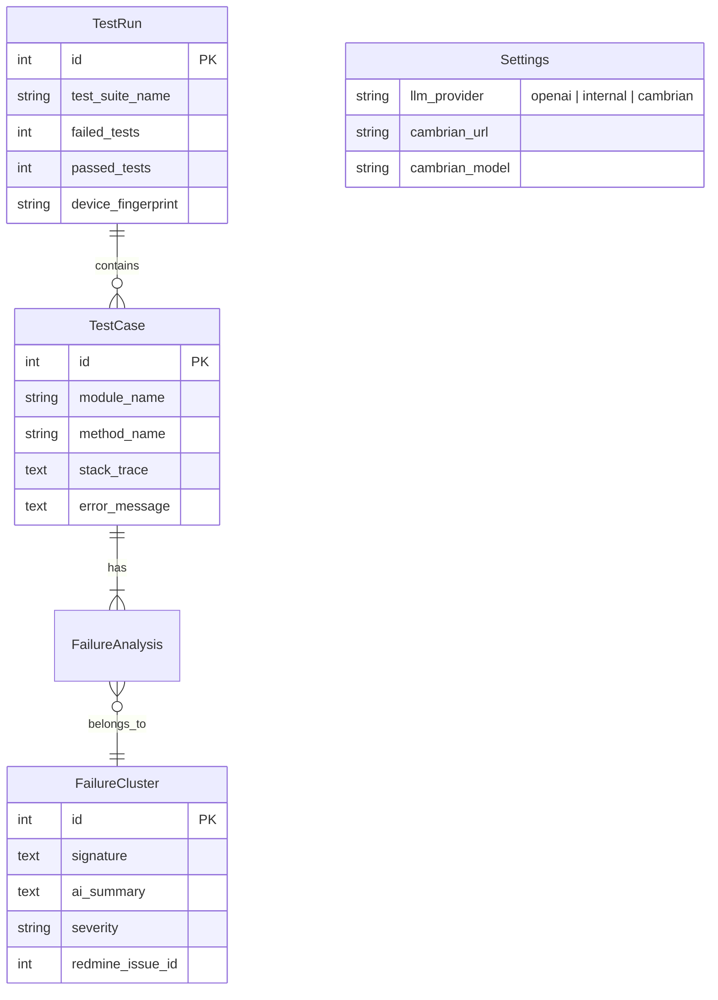

# CTS Insight - Software Architecture & Design (v2.0)

**Last Updated:** 2026-01-20
**Status:** Active / Production

This document provides a comprehensive overview of the CTS Insight's software architecture, reflecting the latest state of the codebase including **Client-Side Parsing**, **Multi-LLM Support (Cambrian/Internal)**, and **Redmine Integration**.

## 🏗️ High-Level Architecture

The system enables Hybrid Processing: heavy XML parsing is offloaded to the client (Web Worker), while AI integration and data persistence are handled by the backend.



## 📦 Component Architecture



## 🔄 Data Flow: Smart Import (Optimized)
Instead of uploading GB-sized XML files, the browser parses them locally and sends only relevant failure data.



## 🧠 AI Analysis & Clustering Flow



## 🗄️ Database Schema (SQLite)

Key tables designed for efficient storage of failures. Passing tests are only aggregated.



## 📁 Directory Structure (2026)

```
GMS-helper/
├── backend/
│   ├── main.py                 # App Entry
│   ├── analysis/               # AI & ML Logic
│   │   ├── clustering.py       # Stack Trace Clustering usage
│   │   └── llm_client.py       # Multi-provider LLM Client
│   │   ├── database.py         # DB Connect
│   │   └── models.py           # SQL Models (TestRun, TestCase)
│   ├── services/               # Shared Business Logic
│   │   └── submission_service.py # Centralized Grouping Logic
│   ├── routers/                # REST Controllers
│   │   ├── analysis.py         # Analysis Endpoints
│   │   ├── import_json.py      # Client-side ingest endpoint
│   │   ├── integrations.py     # Redmine/Jira
│   │   ├── reports.py          # Read-only run data
│   │   └── settings.py         # LLM Config
│   └── static/                 # Frontend Assets
│       ├── app.js              # SPA Logic
│       ├── index.html          # Entry HTML
│       └── xml-parser.worker.js # Background Parser
├── docs/                       # Project Documentation
└── gms_analysis.db            # Local Database
```

## 🚀 Deployment

The system is deployed via Docker Compose containing:
1.  **Backend**: Uvicorn running FastAPI.
2.  **Frontend**: Nginx serving static files and reverse-proxying API.

### Environment variables
*   `DATABASE_URL`: Path to SQLite DB.
*   `OPENAI_API_KEY`: (Optional) for OpenAI.
*   `CAMBRIAN_TOKEN`: (Optional) for Internal LLM.
## 📄 Supplementary Documents
*   [Submission Grouping Design](SUBMISSION_GROUPING_DESIGN.md) - Detailed logic for test run auto-grouping.
*   [AI Analysis Design](LLM_INTEGRATION_DESIGN.md) - Deep dive into LLM integration.
