# GMS Certification Analyzer - Software Architecture

This document provides a comprehensive overview of the GMS Certification Analyzer's software architecture.

## 🏗️ High-Level Architecture

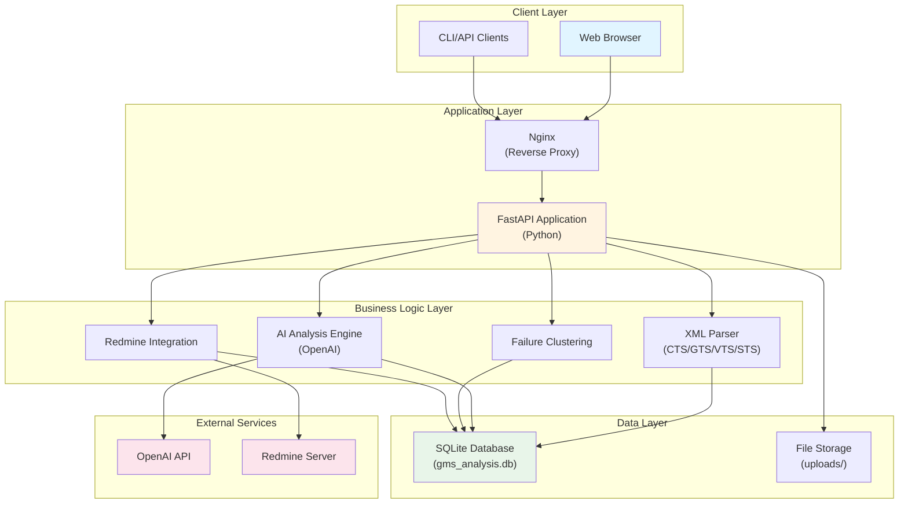

## 📦 Component Architecture

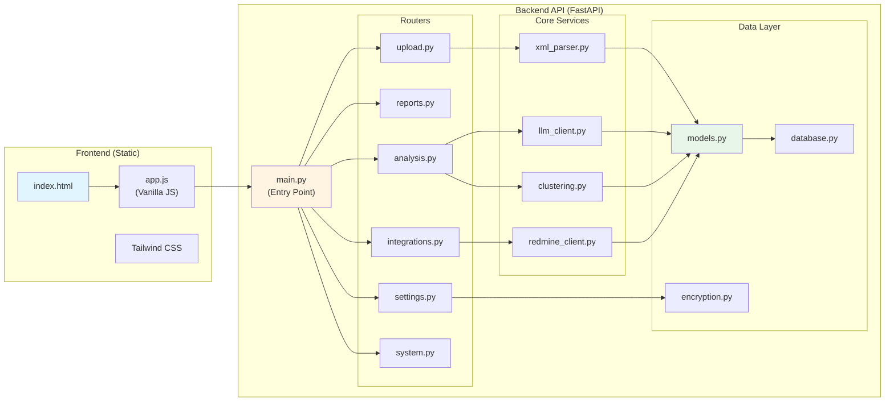

## 🔄 Data Flow - Upload & Analysis

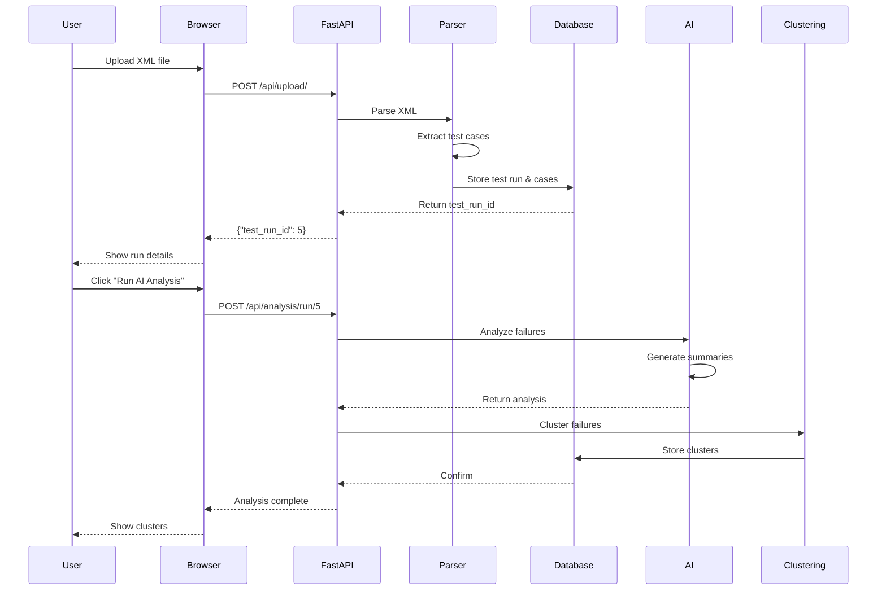

## 🎯 Redmine Integration Flow

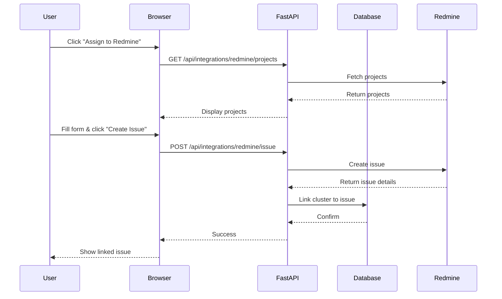

## 🗄️ Database Schema

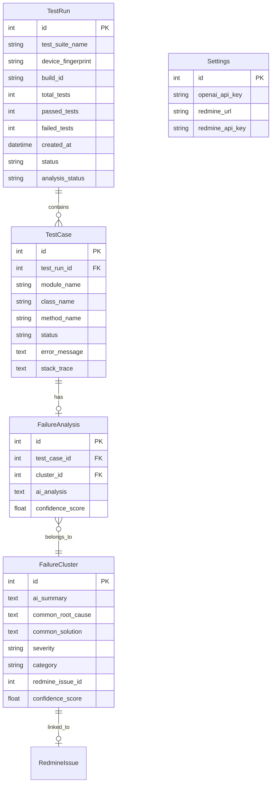

## 📁 Directory Structure

```
GMS-helper/
├── backend/
│   ├── main.py                 # FastAPI application entry
│   ├── routers/                # API endpoints
│   │   ├── upload.py          # File upload handling
│   │   ├── reports.py         # Test run reports
│   │   ├── analysis.py        # AI analysis
│   │   ├── integrations.py    # Redmine integration
│   │   ├── settings.py        # Configuration
│   │   └── system.py          # System operations
│   ├── parser/                 # XML parsers
│   │   ├── base_parser.py     # Base parser class
│   │   └── xml_parser.py      # XML implementation
│   ├── analysis/               # AI & clustering
│   │   ├── llm_client.py      # OpenAI client
│   │   └── clustering.py      # Failure clustering
│   ├── integrations/           # External services
│   │   └── redmine_client.py  # Redmine API client
│   ├── database/               # Data layer
│   │   ├── database.py        # SQLAlchemy setup
│   │   └── models.py          # ORM models
│   ├── utils/                  # Utilities
│   │   └── encryption.py      # API key encryption
│   └── static/                 # Frontend files
│       ├── index.html         # Main UI
│       └── app.js             # Frontend logic
├── uploads/                    # Uploaded XML files
├── gms_analysis.db            # SQLite database
└── requirements.txt           # Python dependencies
```

## 🔐 Security Architecture

```mermaid
graph TB
    subgraph "Security Layers"
        SSL["SSL/TLS<br/>(HTTPS)"]
        Firewall["UFW Firewall"]
        Nginx["Nginx<br/>(Rate Limiting)"]
        
        subgraph "Application Security"
            Encryption["Fernet Encryption<br/>(API Keys)"]
            Validation["Input Validation"]
            CORS["CORS Policy"]
        end
        
        subgraph "External Security"
            CloudflareDNS["Cloudflare DNS"]
            CloudflareProxy["Cloudflare Proxy<br/>(Optional)"]
        end
    end
    
    Internet["Internet"] --> CloudflareDNS
    CloudflareDNS --> CloudflareProxy
    CloudflareProxy --> SSL
    SSL --> Firewall
    Firewall --> Nginx
    Nginx --> Validation
    Validation --> Encryption
    
    style SSL fill:#e8f5e9
    style Encryption fill:#e8f5e9
    style Firewall fill:#fff4e1
```

## 🚀 Deployment Architecture

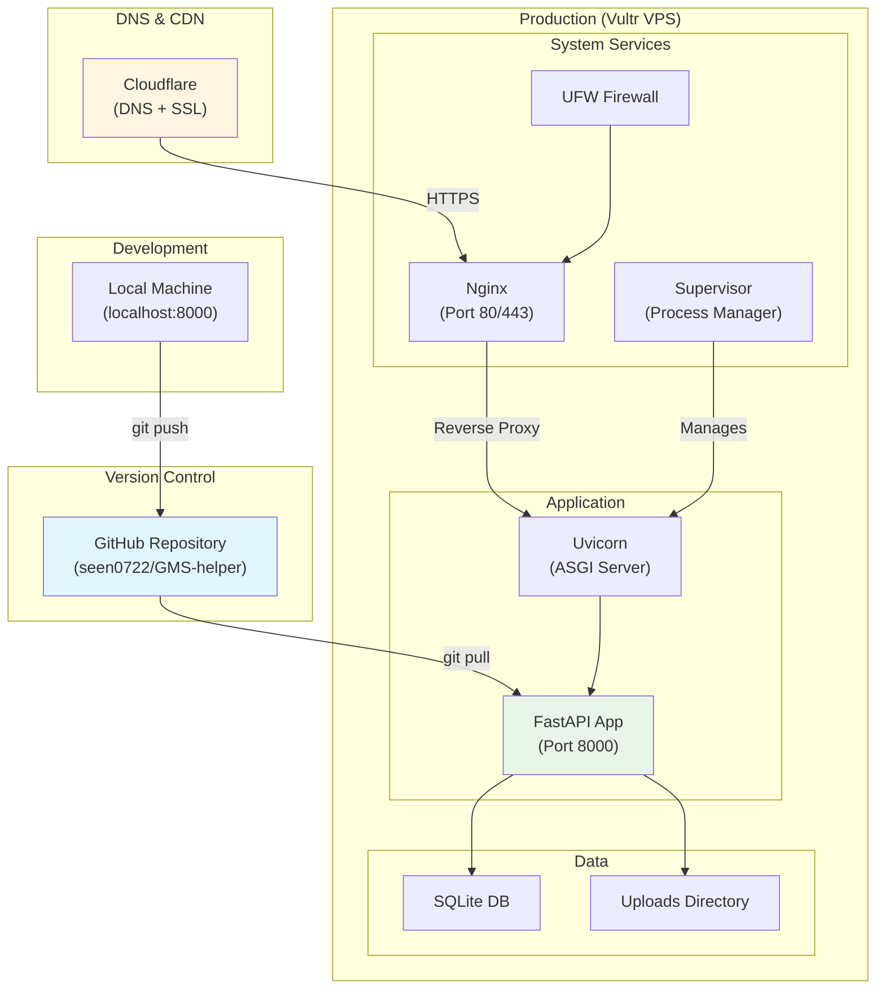

## 🔄 Request Processing Flow

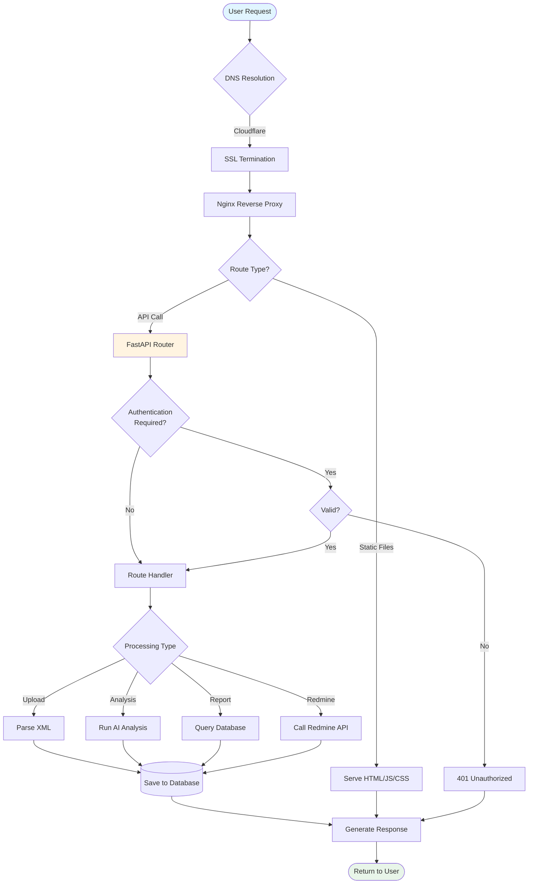

## 📊 Technology Stack

| Layer | Technology | Purpose |
|-------|-----------|---------|
| **Frontend** | HTML5, Vanilla JavaScript, Tailwind CSS | User interface |
| **Backend** | Python 3.8+, FastAPI, Uvicorn | API server |
| **Database** | SQLite, SQLAlchemy | Data persistence |
| **AI/ML** | OpenAI GPT-4 | Failure analysis & clustering |
| **Integration** | Redmine REST API | Issue tracking |
| **Web Server** | Nginx | Reverse proxy, SSL termination |
| **Process Manager** | Supervisor | Application lifecycle |
| **Deployment** | Vultr VPS, Ubuntu 22.04 | Hosting |
| **DNS/CDN** | Cloudflare | DNS, SSL, DDoS protection |
| **Security** | Fernet encryption, Let's Encrypt | API key encryption, SSL |

## 🎨 Frontend Architecture

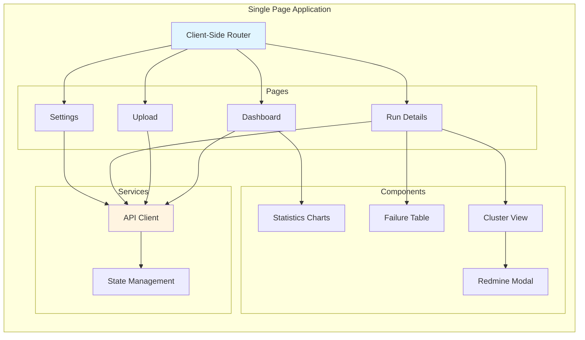

## 🔌 API Architecture

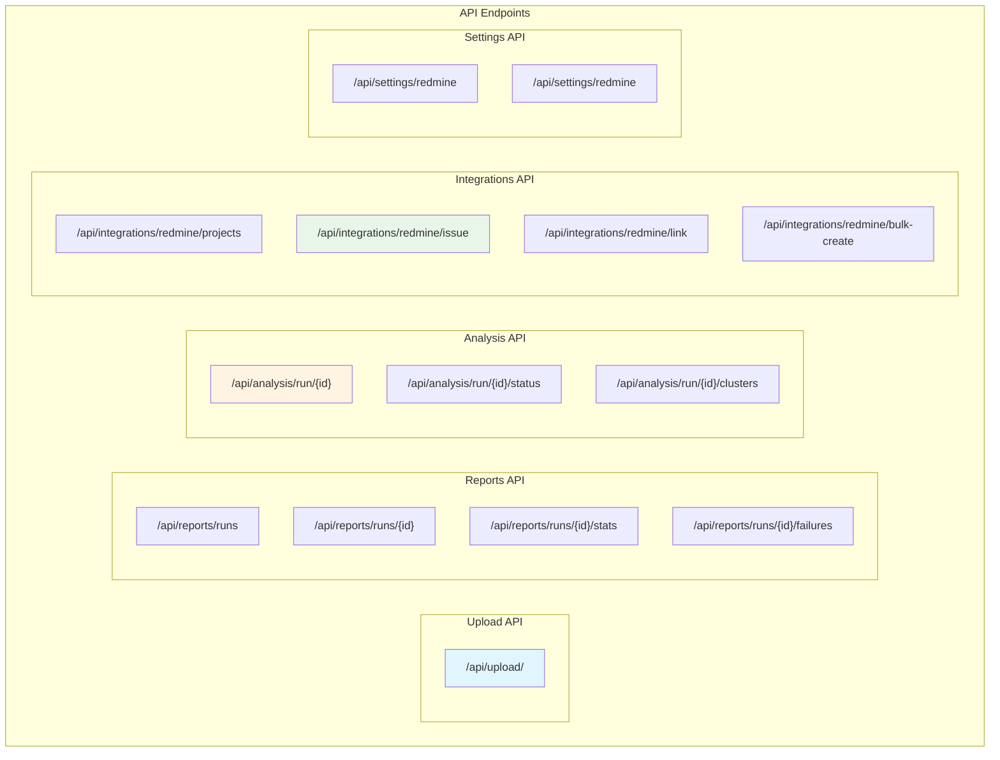

## 📈 Scalability Considerations

### Current Architecture (Single Server)
- **Suitable for**: Small to medium teams
- **Capacity**: ~100 test runs/day
- **Concurrent users**: ~10-20

### Future Scaling Options

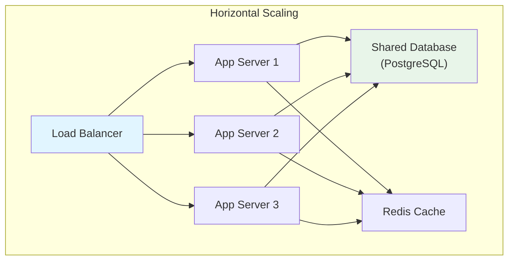

---

## 🎯 Key Design Principles

1. **Separation of Concerns**: Clear boundaries between parsing, analysis, and integration
2. **RESTful API**: Standard HTTP methods and status codes
3. **Asynchronous Processing**: Background tasks for long-running operations
4. **Encryption**: Sensitive data encrypted at rest
5. **Stateless**: API is stateless for easy scaling
6. **Single Page Application**: Fast, responsive UI without page reloads

## 📝 Summary

The GMS Certification Analyzer follows a **three-tier architecture**:
- **Presentation Layer**: Web browser with vanilla JavaScript
- **Application Layer**: FastAPI with modular routers
- **Data Layer**: SQLite with SQLAlchemy ORM

This architecture provides:
- ✅ **Simplicity**: Easy to understand and maintain
- ✅ **Modularity**: Components can be updated independently
- ✅ **Extensibility**: New features can be added easily
- ✅ **Security**: Multiple layers of protection
- ✅ **Scalability**: Can be scaled horizontally when needed
