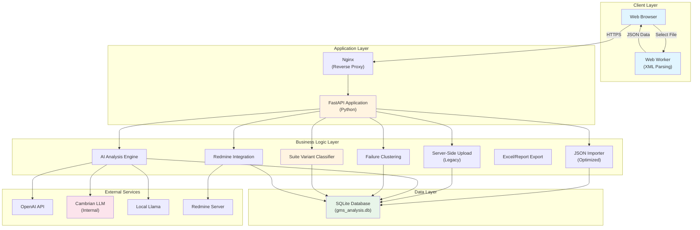
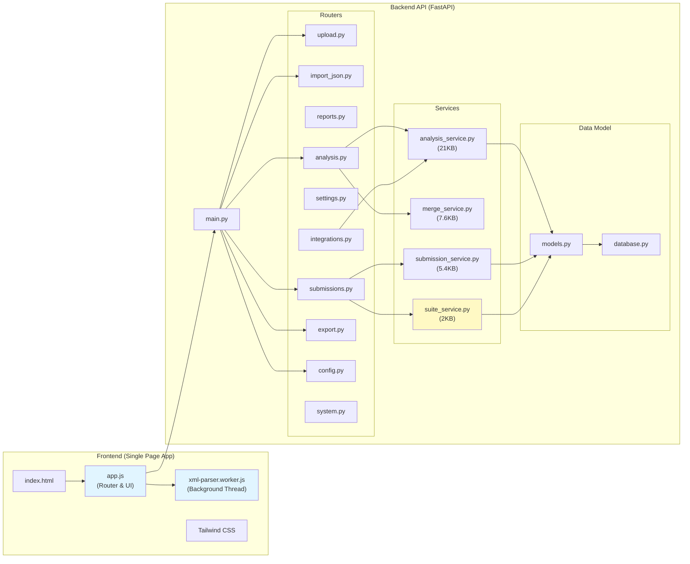
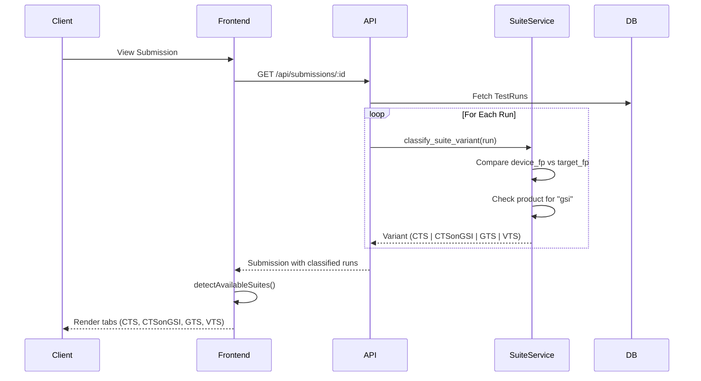
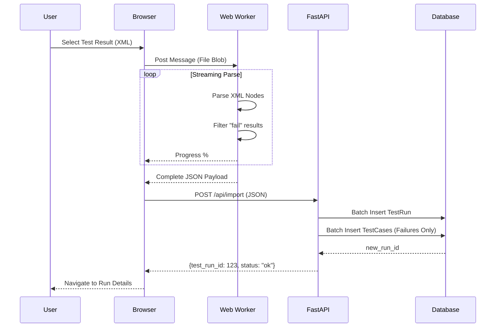
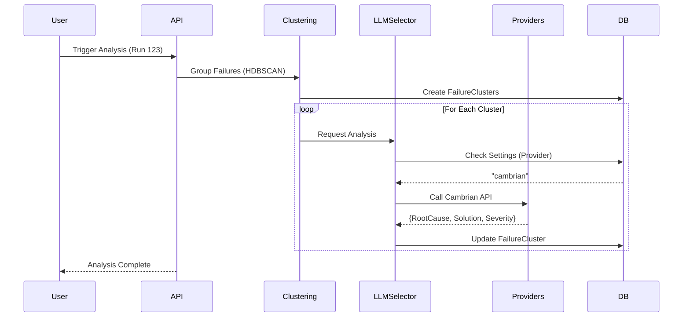
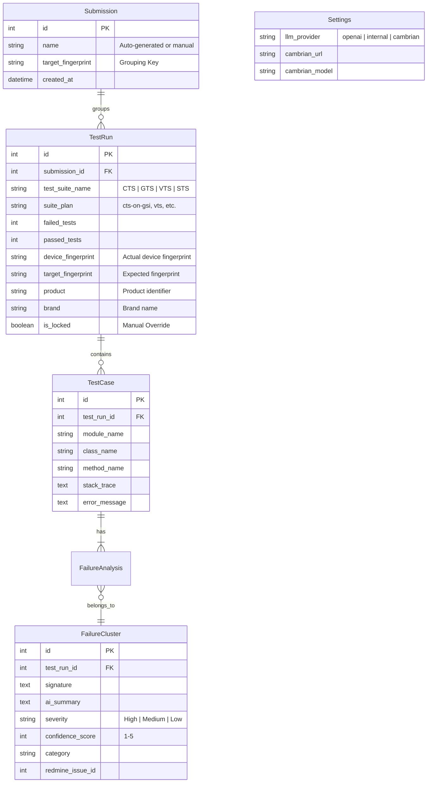

# CTS Insight - 軟體架構與設計 (v3.0)

**最後更新：** 2026-02-08  
**狀態：** Active / Production

本文件提供 CTS Insight 軟體架構的完整概覽，反映最新的程式碼狀態，包含 **Client-Side Parsing**、**Multi-LLM Support (Cambrian/Internal)**、**Redmine Integration** 以及 **Suite Variant Classification (CTS vs CTSonGSI)**。

---

## 🏗️ High-Level Architecture

系統採用混合處理：繁重的 XML 解析工作交由客戶端 (Web Worker) 處理，而 AI 整合與資料持久化則由後端負責。



---

## 📦 Component Architecture



---

## 🎯 Suite Variant Classification

系統支援根據 fingerprint 與測試類型自動分類測試套件變體。

### 分類規則

| Suite Variant | `suite_name` | 分類邏輯 |
|:---|:---|:---|
| **CTS** | "CTS" | `device_fp == target_fp` AND `!product.contains("gsi")` |
| **CTSonGSI** | "CTS" | `device_fp != target_fp` OR `product.contains("gsi")` |
| **GTS** | "GTS" | `suite_name.contains("GTS")` |
| **VTS** | "VTS" | `suite_name.contains("VTS")` |
| **STS** | "STS" | `suite_name.contains("STS")` |

### 實作邏輯

**服務模組**: `backend/services/suite_service.py`

```python
def classify_suite_variant(run):
    if run.suite_name == "CTS":
        # Check for GSI build
        if run.device_fingerprint != run.target_fingerprint:
            return "CTSonGSI"
        if "gsi" in run.product.lower():
            return "CTSonGSI"
        return "CTS"
    
    # Other suites use suite_name directly
    return run.suite_name
```

### Suite Variant Classification Flow



---

## 🔄 Data Flow: Smart Import (Optimized)

不上傳 GB 級別的 XML 檔案，而是由瀏覽器本地解析，僅傳送相關的失敗資料。



---

## 🧠 AI Analysis & Clustering Flow



---

## 📊 Submission Grouping Strategy

Submission 代表一個測試週期或軟體發布里程碑。系統根據 fingerprint 自動將 test runs 分組至對應的 Submission。

### Grouping Rules

#### 1. Exact Fingerprint Match (Standard)
適用於大多數測試套件 (GTS, STS 等)，系統要求 **100% 完全符合** 裝置 fingerprint。

- **Fingerprint Format:** `Brand/Product/Device:Version/BuildID/Suffix`
- **結果**: 任何版本或 build ID 的變化會觸發新 Submission 的建立

#### 2. System-Replace Match (CTSonGSI / VTS)
針對系統映像被替換，但硬體/vendor 層保持一致的測試，使用 **Relaxed Grouping** 邏輯。

**觸發條件:**
- `suite_name == "CTS"` AND (`device_fp != target_fp` OR `product.contains("gsi")`)
- **OR** `suite_name == "VTS"` AND `suite_plan.contains("vts")`

**Fingerprint Parsing Logic:**

Fingerprint 被解析為四個部分，使用 Regex: `^([^:]+):([^/]+)/([^/]+)(/.+)$`

| Segment | Example | Matching Rule |
|:---|:---|:---|
| **Prefix (Hardware)** | `Trimble/T70/thorpe` | **Must Match Exactly** |
| **Version** | `15` vs `11` | **Ignored** |
| **Build ID (System)** | `AQ3A.250408.001` | **Ignored** |
| **Suffix (Vendor)** | `/02.00.11.2508...` | **Must Match Exactly** |

**實作邏輯** (`backend/services/submission_service.py`):

```python
def get_or_create_submission(run):
    if is_system_replace(run):
        prefix, suffix = parse_fingerprint(run.target_fp)
        match = find_submission(prefix=prefix, suffix=suffix)
        if match: return match
    else:
        match = find_submission(full_fp=run.target_fp)
        if match: return match
    
    # Create new: [Model] ([Device]) · [Suffix]
    return create_new_submission(run.metadata)
```

---

## 🗄️ Database Schema (SQLite)

關鍵資料表專為高效儲存失敗資料設計。通過的測試僅聚合統計。



### Computed Fields

- **`is_gsi`** (derived): `device_fingerprint != target_fingerprint OR product.contains("gsi")`
- **`suite_variant`** (runtime): Computed by `SuiteService.classify_suite_variant()`

---

## 📁 Directory Structure

```
GMS-helper/
├── backend/
│   ├── main.py                      # App Entry Point
│   ├── analysis/                    # AI & ML Logic
│   │   ├── clustering.py            # HDBSCAN Clustering (30KB)
│   │   └── llm_client.py            # Multi-provider LLM Client (14KB)
│   ├── database/                    # Data Layer
│   │   ├── database.py              # DB Connection
│   │   └── models.py                # SQLAlchemy Models
│   ├── services/                    # Business Logic Services
│   │   ├── analysis_service.py      # AI Analysis Orchestration (21KB)
│   │   ├── merge_service.py         # Test Run Merging (7.6KB)
│   │   ├── submission_service.py    # Submission Grouping (5.4KB)
│   │   └── suite_service.py         # Suite Variant Classification (2KB)
│   ├── routers/                     # REST API Controllers
│   │   ├── analysis.py              # AI Analysis Endpoints
│   │   ├── config.py                # Configuration Management
│   │   ├── export.py                # Excel/Report Export
│   │   ├── import_json.py           # Client-side JSON Ingestion
│   │   ├── integrations.py          # Redmine/Jira Integration
│   │   ├── reports.py               # Read-only Run Data
│   │   ├── settings.py              # LLM Configuration
│   │   ├── submissions.py           # Submission CRUD
│   │   ├── system.py                # System Health
│   │   └── upload.py                # Legacy Server-side Upload
│   └── static/                      # Frontend Assets
│       ├── app.js                   # SPA Router & UI Logic
│       ├── index.html               # Entry HTML
│       └── xml-parser.worker.js     # Background XML Parser
├── docs/                            # Project Documentation
│   ├── ARCHITECTURE.md              # This Document
│   ├── AI_ANALYSIS.md               # LLM Integration Details
│   ├── SUBMISSION_GROUPING_DESIGN.md # Grouping Logic Spec
│   └── implementation_plan_suite_variant.md # Suite Classification
├── scripts/                         # Utility Scripts
│   ├── migrate_db.py                # Database Migrations
│   └── verify_db.py                 # DB Integrity Checks
└── gms_analysis.db                  # SQLite Database
```

---

## 🚀 Deployment

系統透過 Docker Compose 部署，包含：

1. **Backend**: Uvicorn 運行 FastAPI
2. **Frontend**: Nginx 提供靜態文件與 API 反向代理

### Environment Variables

| Variable | Purpose | Required |
|:---|:---|:---|
| `DATABASE_URL` | SQLite DB 路徑 | Yes |
| `OPENAI_API_KEY` | OpenAI API 金鑰 | Optional |
| `CAMBRIAN_TOKEN` | Cambrian LLM Token | Optional |
| `CAMBRIAN_BASE_URL` | Cambrian Gateway URL | Optional |
| `REDMINE_URL` | Redmine 伺服器位址 | Optional |
| `REDMINE_API_KEY` | Redmine API 金鑰 | Optional |

### Docker Compose Example

```yaml
version: '3.8'
services:
  backend:
    build: .
    ports:
      - "8000:8000"
    environment:
      - DATABASE_URL=/data/gms_analysis.db
      - CAMBRIAN_TOKEN=${CAMBRIAN_TOKEN}
    volumes:
      - ./data:/data
  
  nginx:
    image: nginx:alpine
    ports:
      - "80:80"
    volumes:
      - ./nginx.conf:/etc/nginx/nginx.conf
    depends_on:
      - backend
```

---

## 📄 Supplementary Documents

- **[AI Analysis Design](AI_ANALYSIS.md)** - LLM integration、prompting strategy、clustering algorithm 深入解析
- **[Submission Grouping Design](SUBMISSION_GROUPING_DESIGN.md)** - Test run auto-grouping 詳細邏輯
- **[Suite Variant Implementation](implementation_plan_suite_variant.md)** - CTS vs CTSonGSI 分類實作計畫

---

## 🔄 Version History

| Version | Date | Changes |
|:---|:---|:---|
| **v3.0** | 2026-02-08 | 新增 Suite Variant Classification、更新 Service Layer (4 services)、擴充 Router (10 endpoints)、強化 Database Schema |
| **v2.0** | 2026-01-20 | Client-Side Parsing、Multi-LLM Support、Redmine Integration |
| **v1.0** | 2025-12-15 | Initial Architecture Document |

---

**維護者**: GMS-Helper Team  
**聯絡方式**: 透過 GitHub Issues 或內部 Slack Channel
