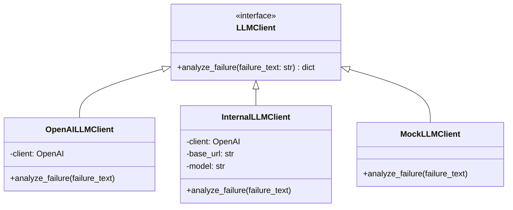
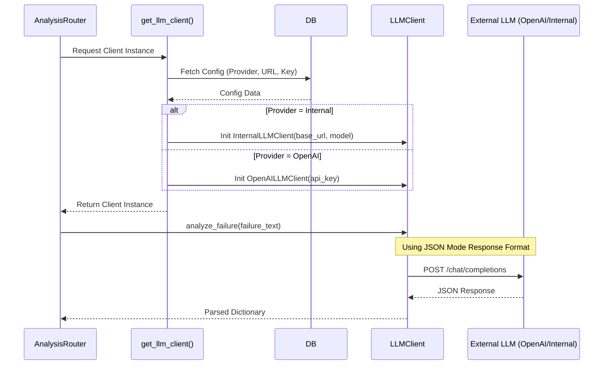

# LLM Integration & Connection Design

> **Version**: 1.0
> **Date**: 2026-01-08
> **Status**: Approved

This document details the architectural design for connecting the GMS-helper application to various LLM backend providers, specifically OpenAI and Internal LLMs (like vLLM or Ollama).

## 1. Architecture Overview

We utilize the **Strategy Pattern** to decouple the application logic from the specific LLM provider implementation. This allows seamless switching between providers without modifying the core analysis logic.



### Core Components

1.  **`LLMClient` (Interface)**: Defines the standard contract (`analyze_failure`) that all providers must implement.
2.  **`Factory` (`get_llm_client`)**: Responsible for instantiating the correct client based on system configuration.

## 2. Connection Protocols

### 2.1 OpenAI Connection

*   **Protocol**: HTTPS (Standard OpenAI API)
*   **Library**: Official `openai` Python SDK
*   **Authentication**: Bearer Token (API Key)
*   **Endpoint**: Default OpenAI endpoints (e.g., `https://api.openai.com/v1`)

**Implementation Detail**:
```python
# Standard initialization
self.client = OpenAI(api_key=settings.openai_api_key)
```

### 2.2 Internal LLM (vLLM / Ollama) Connection

Most modern internal LLM servers (vLLM, Ollama, TGI) provide an **OpenAI-compatible API**. This allows us to reuse the same client library and request format, changing only the connection parameters.

*   **Protocol**: HTTP/HTTPS
*   **Library**: Official `openai` Python SDK (reused)
*   **Authentication**: Optional (often unrestricted on internal networks) or Custom Key.
*   **Endpoint**: Custom `base_url` pointing to the internal server.

**Implementation Detail**:
```python
# Configuring OpenAI SDK to point to internal server
self.client = OpenAI(
    base_url="http://internal-llm.company.local:8000/v1",  # Key configuration
    api_key="not-needed"  # Often required by SDK validation but ignored by server
)
```

**Supported Internal Backends**:
*   **Ollama**: `http://localhost:11434/v1`
*   **vLLM**: `http://<server-ip>:8000/v1`
*   **LocalAI**: `http://localhost:8080/v1`

## 3. Configuration Management

The system determines which provider to use based on a priority hierarchy:

1.  **Database Settings**: (Primary) Configured via UI `Settings` page.
    *   `llm_provider`: `openai` | `internal`
    *   `internal_llm_url`: URL for internal server
    *   `internal_llm_model`: Model name (e.g., `llama3.1`)
2.  **Environment Variables**: (Fallback) `OPENAI_API_KEY`
3.  **Mock Fallback**: Used if no configuration is found or connections fail.

## 4. Request Flow Sequence



## 5. Security & Error Handling

*   **API Keys**: Stored in the database using **Fernet Symmetric Encryption**. Never stored in plain text.
*   **Error Handling**:
    *   Network timeouts or 5xx errors from providers are caught.
    *   Fallback to a structured "Error Analysis" result (severity: Low) instead of crashing the application.
    *   Errors are logged to the server console for debugging.

## 6. Future Extensibility

To add a new provider (e.g., **Azure OpenAI** or **Google Vertex AI**):

1.  Create `AzureLLMClient` inheriting from `LLMClient`.
2.  Implement `analyze_failure` using the Azure SDK.
3.  Update `models.py` to add Azure-specific settings (Endpoint, Deployment Name).
4.  Update `get_llm_client` factory to handle the new `azure` provider type.
