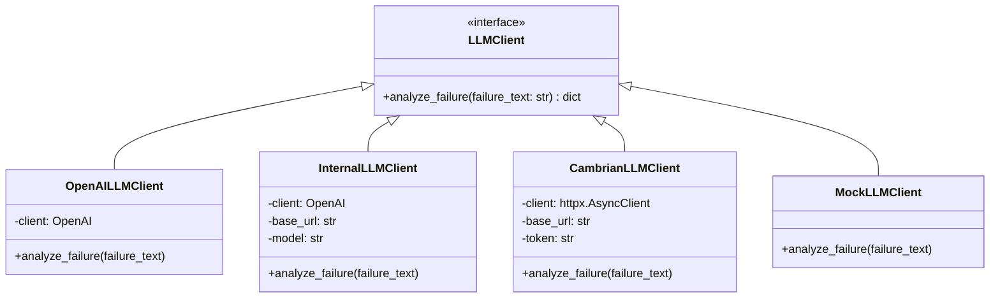
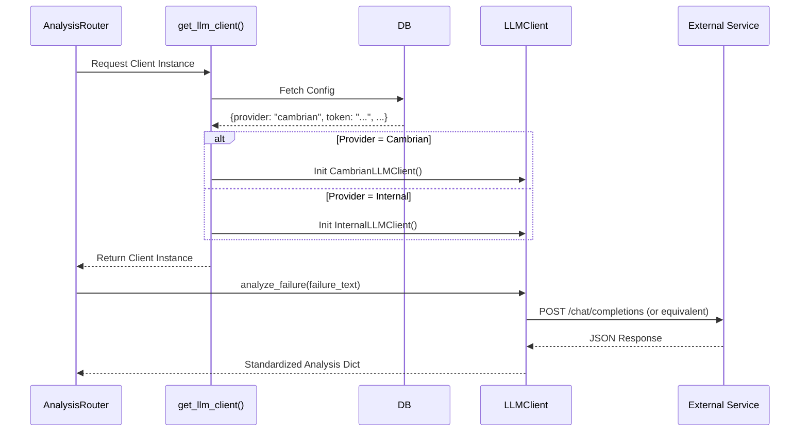

# LLM Integration & Connection Design

> **Version**: 2.0
> **Date**: 2026-01-20
> **Status**: Live / Production

This document details the architectural design for connecting the GMS-helper application to various LLM backend providers, specifically **OpenAI**, **Internal LLMs** (vLLM/Ollama), and **Cambrian LLM** (Internal Enterprise).

## 1. Architecture Overview

We utilize the **Strategy Pattern** to decouple the application logic from the specific LLM provider implementation. This allows seamless switching between providers without modifying the core analysis logic.

### Core Components

1.  **`LLMClient` (Interface)**: Defines the standard contract (`analyze_failure`) that all providers must implement.
2.  **`Factory` (`get_llm_client`)**: Responsible for instantiating the correct client based on system configuration.

## 2. Connection Protocols

### 2.1 OpenAI Connection
*   **Protocol**: HTTPS (Standard OpenAI API).
*   **Library**: Official `openai` Python SDK.
*   **Authentication**: Bearer Token (API Key).

### 2.2 Internal LLM (vLLM / Ollama)
Standard OpenAI-compatible endpoints on the local network.
*   **Library**: Official `openai` Python SDK (reconfigured).
*   **Endpoint**: Custom `base_url` (e.g., `http://localhost:11434/v1`).
*   **Authentication**: Often unrestricted or dummy key.

### 2.3 Cambrian LLM (Enterprise Internal)
A specialized internal LLM service requiring specific authentication headers.
*   **Protocol**: HTTPS (Internal PKI).
*   **Library**: `httpx` (Direct REST calls).
*   **Authentication**: Custom Header (`Authorization: <token>`).
*   **Endpoint**: `https://api.cambrian.pegatroncorp.com` (Default).
*   **SSL Verification**: Configurable (often `verify=False` for internal self-signed certs).

## 3. Configuration Management

The system determines which provider to use based on the `Settings` table in the database:

1.  **Provider Selection**: `llm_provider` enum (`openai`, `internal`, `cambrian`).
2.  **Provider-Specific Settings**:
    *   **OpenAI**: `openai_api_key`.
    *   **Internal**: `internal_llm_url`, `internal_llm_model`.
    *   **Cambrian**: `cambrian_url`, `cambrian_token`, `cambrian_model`.

## 4. Request Flow Sequence

## 5. Security & Error Handling

*   **API Keys/Tokens**: Stored encrypted in the database using **Fernet Symmetric Encryption**.
*   **Error Resilience**:
    *   If the primary configured LLM fails (timeout/500), the system catches the exception.
    *   Returns a "Manual Analysis Required" placeholder rather than crashing.
    *   Logs detailed errors for administrator review.
