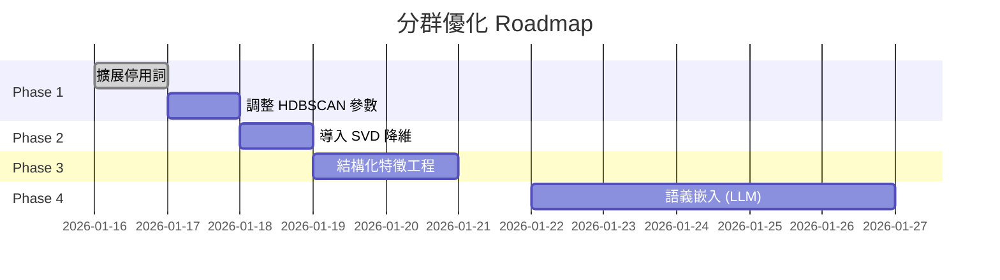

# PRD: 分群品質優化 (Clustering Quality Optimization)

## 文件資訊
| 項目 | 內容 |
| :--- | :--- |
| 版本 | v1.0 |
| 作者 | Chen Zeming |
| 日期 | 2026-01-16 |
| 狀態 | Draft |

---

## 1. 背景與問題

### 1.1 目標
提升 AI 分群 (Failure Clustering) 功能的品質，使其產生更有意義、更可操作的分群結果，而非「雜物抽屜」式的大雜燴群集。

### 1.2 現狀分析 (基於 Run #6 實測數據)

| 指標 | 數值 | 評估 |
| :--- | :--- | :--- |
| **樣本數** | 22 | 樣本量偏少 |
| **HDBSCAN 原始分群數** | 2 | 分群過於粗糙 |
| **離群點比例** | 22.7% | 偏高 |
| **輪廓係數 (Silhouette Score)** | **0.046** | ❌ 極低，群集區分度差 |
| **TF-IDF 特徵維度** | 866 | ⚠️ 維度災難 |
| **後處理後分群數** | 6 | 透過 Outlier Handling 改善 |

### 1.3 已識別問題

1.  **維度災難 (Curse of Dimensionality)**: 866 維的稀疏 TF-IDF 向量使距離度量失效。
2.  **特徵噪音**: 行號、路徑片段等無區分性的 token 污染特徵空間。
3.  **語義缺失**: TF-IDF 只捕捉詞頻，無法理解「Permission denied」與「Access not allowed」語義相近。
4.  **「雜物抽屜」群集**: Cluster 20 混合了 5 個模組的失敗，缺乏實際意義。

---

## 2. 改進目標 (Success Metrics)

| 指標 | 當前值 | 目標值 | 定義 |
| :--- | :--- | :--- | :--- |
| **輪廓係數** | 0.046 | > 0.2 | 群內凝聚度與群間分離度 |
| **平均群集純度 (Purity)** | ~0.55 | > 0.8 | 群內樣本來自相同 Module 的比例 |
| **單一 Module 群集比例** | 66% (4/6) | > 80% | 純淨群占總群數比例 |
| **最大群集占比** | 50% (11/22) | < 30% | 避免單一「雜物抽屜」過大 |

---

## 3. 解決方案 (提案)

### Phase 1: 低風險優化 (Low-Hanging Fruits)

#### 3.1 擴展停用詞 (Stop Words)
*   **目標**: 減少噪音特徵。
*   **方法**: 將常見 Framework 路徑、行號模式加入 `DOMAIN_STOP_WORDS`。
*   **優先級**: P0
*   **預估工時**: 0.5 天

#### 3.2 調整 HDBSCAN 參數
*   **目標**: 在小樣本下獲得更細粒度分群。
*   **方法**: 將 `min_cluster_size` 從 3 降至 2，並測試 `cluster_selection_epsilon`。
*   **優先級**: P1
*   **預估工時**: 1 天

---

### Phase 2: 降維處理 (Dimensionality Reduction)

#### 3.3 導入 SVD/TruncatedSVD
*   **目標**: 緩解維度災難，提升輪廓係數。
*   **方法**: 在 TF-IDF 後加入 `TruncatedSVD(n_components=50-100)`。
*   **優先級**: P1
*   **預估工時**: 1 天
*   **風險**: 可能損失部分區分性特徵。

```python
# 參考實現
from sklearn.decomposition import TruncatedSVD

svd = TruncatedSVD(n_components=100, random_state=42)
tfidf_reduced = svd.fit_transform(tfidf_matrix)
```

---

### Phase 3: 結構化特徵工程 (Feature Engineering)

#### 3.4 混合特徵向量
*   **目標**: 讓 Module/Class 資訊對分群有更直接的影響。
*   **方法**: 將 `module_name`, `class_name`, `exception_type` 進行 One-Hot 或 Hash Encoding，並與 TF-IDF 向量拼接。
*   **優先級**: P2
*   **預估工時**: 2 天

```python
# 概念驗證
from sklearn.preprocessing import LabelEncoder
import numpy as np

module_encoded = LabelEncoder().fit_transform(modules)
combined_features = np.hstack([tfidf_matrix.toarray(), module_encoded.reshape(-1, 1) * weight])
```

---

### Phase 4: 語義嵌入 (Semantic Embedding) - 長期方案

#### 3.5 導入 Sentence-BERT / LLM Embedding
*   **目標**: 捕捉語義相似性，而非純詞頻相似性。
*   **方法**: 使用 `sentence-transformers` 庫或調用 LLM API 獲取 Stack Trace 的嵌入向量。
*   **優先級**: P3
*   **預估工時**: 3-5 天
*   **風險**: 增加 LLM API 成本或本地計算資源需求。

---

## 4. 實施計畫



---

## 5. 風險與依賴

| 風險 | 影響 | 緩解措施 |
| :--- | :--- | :--- |
| 小樣本下過度分群 | 群集數過多，增加分析負擔 | 設定 `max_clusters` 上限 |
| LLM Embedding 成本 | API 費用增加 | 本地部署輕量模型 (e.g., `all-MiniLM-L6-v2`) |
| 降維損失關鍵特徵 | 分群準確性下降 | A/B 測試比較 SVD 前後效果 |

---

## 6. Phase 5: 階層式 UI 呈現 (Hierarchical UI)

### 6.1 背景
當前 UI 將分群結果以扁平列表呈現，導致用戶難以理解模組全貌。

### 6.2 設計目標
- **保留 ML 細分群的洞察價值**
- **提供模組層級的總覽**
- **支持折疊/展開操作**

### 6.3 API 調整

#### 新增端點: `GET /api/analysis/run/{run_id}/clusters/by-module`

```json
{
  "modules": [
    {
      "name": "CtsViewTestCases",
      "total_failures": 38,
      "priority": "P1",
      "clusters": [
        {"id": 1, "name": "TooltipTest 問題", "failures": 18, "severity": "Medium"},
        {"id": 2, "name": "KeyEventTest 問題", "failures": 4, "severity": "Medium"}
      ]
    }
  ]
}
```

### 6.4 前端 UI 設計

```
▼ CtsViewTestCases                    38 failures  [P1]
  ├── TooltipTest 長按問題            18 failures
  ├── KeyEventInjectionTest           4 failures
  └── 其他 View 測試                  16 failures

▶ CtsNfcTestCases                     6 failures   [P2]
```

### 6.5 優先級規則

| 條件 | 優先級 |
| :--- | :--- |
| Severity = High | P0 |
| Total Failures > 15 | P1 |
| Total Failures 5-15 | P2 |
| Total Failures < 5 | P3 |

### 6.6 工時估計

| 項目 | 工時 |
| :--- | :--- |
| API `/clusters/by-module` | 2h |
| 前端 ModuleCard 組件 | 3h |
| 優先級計算邏輯 | 1h |
| 測試 + 調整 | 2h |
| **總計** | **8h** |

---

## 7. 附錄: Run #6 分群結果詳情

| Cluster ID | Failure Count | Modules | Purity | 評價 |
| :--- | :--- | :--- | :--- | :--- |
| 19 | 6 | `CtsActivityRecognition`, `CtsAutoFillService`, `CtsAppTestCases` | 0.33 | ⚠️ 混合群 |
| 20 | 11 | `CtsAppCloning`, `CtsAppSecurity`, `CtsBluetooth` 等 | 0.20 | ❌ 雜物抽屜 |
| 21 | 1 | `CtsAppPredictionService` | 1.00 | ✅ 純淨群 |
| 22 | 1 | `CtsBlobStore` | 1.00 | ✅ 純淨群 |
| 23 | 2 | `CtsAppFgsStartTest` | 1.00 | ✅ 純淨群 |
| 24 | 1 | `CtsAppOpsTest` | 1.00 | ✅ 純淨群 |
