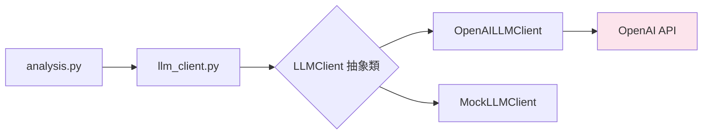
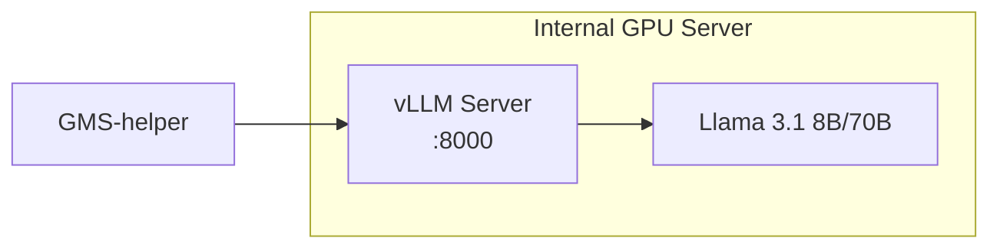

# PRD: GMS-helper LLM 內部部署遷移方案

> **文檔版本**: v1.0  
> **日期**: 2026-01-06  
> **作者**: AI Assistant  
> **狀態**: Draft - 待審核

---

## 1. 當前架構分析

### 1.1 OpenAI API 使用現況



| 組件 | 檔案路徑 | 用途 |
|------|---------|------|
| **LLM Client** | `backend/analysis/llm_client.py` | OpenAI API 唯一入口點 |
| **Settings Router** | `backend/routers/settings.py` | API Key 管理 (加密儲存) |
| **Analysis Router** | `backend/routers/analysis.py` | 呼叫 `get_llm_client()` 進行分析 |
| **Encryption** | `backend/utils/encryption.py` | Fernet 加密 API Key |

### 1.2 現有抽象設計優勢

目前程式碼已採用**策略模式 (Strategy Pattern)**：

```python
# backend/analysis/llm_client.py
class LLMClient(ABC):
    @abstractmethod
    def analyze_failure(self, failure_text: str) -> dict:
        pass

class OpenAILLMClient(LLMClient):  # 實作 1
    def __init__(self, api_key: str): ...

class MockLLMClient(LLMClient):    # 實作 2 (測試用)
    def analyze_failure(...): ...
```

> [!TIP]
> **良好的基礎架構**：現有的 `LLMClient` 抽象類使得替換 LLM 後端只需新增實作，無需修改呼叫端 (`analysis.py`)。

### 1.3 OpenAI API 呼叫分析

```python
# 目前使用方式
response = self.client.chat.completions.create(
    model="gpt-4o-mini",
    messages=[
        {"role": "system", "content": SYSTEM_PROMPT},
        {"role": "user", "content": failure_text[:3000]}
    ],
    response_format={"type": "json_object"}
)
```

**API 功能需求**:
- Chat Completion 模型
- JSON Mode 回傳結構化資料
- Token Limit ~3000 chars input

---

## 2. 遷移方案選項

### 2.1 內部部署 LLM 選項比較

| 方案 | 模型 | 部署方式 | GPU 需求 | 維護成本 | JSON Mode | 推薦度 |
|------|------|---------|---------|---------|-----------|--------|
| **A. vLLM + Llama 3** | Llama 3.1 8B/70B | Docker + GPU Server | 1x A100 (70B) 或 1x RTX 4090 (8B) | 中 | ✅ | ⭐⭐⭐⭐⭐ |
| **B. Ollama** | Mistral/Llama/Qwen | 本地安裝 | 1x RTX 3090+ | 低 | ✅ | ⭐⭐⭐⭐ |
| **C. TGI (HuggingFace)** | 任意 HF 模型 | Docker | 依模型 | 中高 | ✅ | ⭐⭐⭐ |
| **D. Azure OpenAI** | GPT-4o | Azure 雲端 | 無需 | 低 | ✅ | ⭐⭐⭐⭐ |
| **E. 本地 Fine-tuned** | Qwen2.5-7B | 自建推理 | 1x RTX 4090 | 高 | ✅ | ⭐⭐⭐ |

> [!IMPORTANT]
> **推薦方案 A (vLLM + Llama 3)** - 開源、支援 OpenAI API 相容格式，遷移成本最低。

### 2.2 各方案詳細說明

#### 方案 A: vLLM + Llama 3 (推薦)

**優點**:
- 完全 OpenAI API 相容，改 `base_url` 即可
- 高吞吐量 (PagedAttention)
- 開源可控、無資料外洩風險

**部署架構**:


#### 方案 B: Ollama (快速驗證)

**優點**:
- 單一 binary 安裝，5 分鐘上線
- 也提供 OpenAI 相容 API

**限制**:
- 單機部署，不支援分散式推理
- 適合小團隊 (<10 人同時使用)

#### 方案 D: Azure OpenAI (合規替代)

**優點**:
- 如果公司已有 Azure 訂閱
- 資料合規 (不經過公共 OpenAI Endpoint)

**限制**:
- 仍是雲端服務，有網路延遲
- 需 Azure 帳號審批

---

## 3. 推薦方案: vLLM + Llama 3 實作規格

### 3.1 程式碼變更

#### [MODIFY] [llm_client.py](file:///Users/chenzeming/dev/GMS-helper/backend/analysis/llm_client.py)

新增 `InternalLLMClient` 類別：

```python
class InternalLLMClient(LLMClient):
    """使用內部 vLLM/Ollama 服務的 LLM 客戶端"""
    
    def __init__(self, base_url: str, api_key: str = "not-needed", model: str = "llama3.1"):
        self.client = OpenAI(
            base_url=base_url,  # e.g., "http://internal-llm.company.com:8000/v1"
            api_key=api_key
        )
        self.model = model

    def analyze_failure(self, failure_text: str) -> dict:
        response = self.client.chat.completions.create(
            model=self.model,
            messages=[...],
            response_format={"type": "json_object"}
        )
        # ...same parsing logic
```

#### [MODIFY] [models.py](file:///Users/chenzeming/dev/GMS-helper/backend/database/models.py)

Settings table 新增欄位：

```python
class Settings(Base):
    # 現有欄位
    openai_api_key = Column(String)
    
    # 新增欄位
    llm_provider = Column(String, default="openai")  # openai | internal | azure
    internal_llm_url = Column(String)                # http://internal-llm:8000/v1
    internal_llm_model = Column(String, default="llama3.1")
```

#### [MODIFY] [settings.py](file:///Users/chenzeming/dev/GMS-helper/backend/routers/settings.py)

新增 LLM Provider 設定 API：

```python
@router.get("/llm-provider")
def get_llm_provider(db: Session = Depends(get_db)):
    """取得目前 LLM Provider 設定"""
    ...

@router.put("/llm-provider")
def update_llm_provider(data: LLMProviderUpdate, db: Session = Depends(get_db)):
    """更新 LLM Provider (openai/internal/azure)"""
    ...
```

#### [MODIFY] [app.js](file:///Users/chenzeming/dev/GMS-helper/backend/static/app.js)

Settings 頁面新增 LLM Provider 選擇器 UI。

### 3.2 資料庫 Migration

```sql
-- migration: add_llm_provider_settings.sql
ALTER TABLE settings ADD COLUMN llm_provider VARCHAR(20) DEFAULT 'openai';
ALTER TABLE settings ADD COLUMN internal_llm_url VARCHAR(255);
ALTER TABLE settings ADD COLUMN internal_llm_model VARCHAR(50) DEFAULT 'llama3.1';
```

### 3.3 需要的 Infrastructure

| 項目 | 規格 | 用途 |
|------|------|------|
| **GPU Server** | 1x NVIDIA A100 80GB 或 2x RTX 4090 | 運行 vLLM + Llama 3.1 70B |
| **Docker Host** | Ubuntu 22.04 + NVIDIA Container Toolkit | 容器化部署 |
| **Internal DNS** | `internal-llm.company.com` | 服務發現 |

> [!WARNING]
> **硬體需求**: Llama 3.1 70B 需約 140GB VRAM (FP16) 或 70GB (INT8 Quantization)。若只用 8B 版本，單張 RTX 4090 即可。

---

## 4. User Review Required

以下項目需要使用者確認：

1. **LLM 部署方案選擇**: 建議方案 A (vLLM)，貴司是否有足夠 GPU 資源？
2. **模型選擇**: Llama 3.1 8B (快速) vs 70B (高品質)？
3. **是否需要保留 OpenAI 作為 Fallback**？
4. **內部 LLM Server 的 URL 命名** (建議: `http://internal-llm.company.local:8000/v1`)
5. **是否需要 Azure OpenAI 作為替代方案**？

---

## 5. 驗證計劃

### 5.1 單元測試

```bash
# 新增測試案例
cd /Users/chenzeming/dev/GMS-helper
python -m pytest tests/ -k "test_internal_llm_client" -v
```

測試項目：
- [ ] `InternalLLMClient` 初始化正確
- [ ] `InternalLLMClient.analyze_failure()` 回傳格式正確
- [ ] `get_llm_client()` 根據 Settings 正確選擇 Provider

### 5.2 整合測試

模擬 Ollama 進行端到端測試：

```bash
# 1. 啟動 Ollama (本地)
ollama serve

# 2. 下載模型
ollama pull llama3.1:8b

# 3. 設定 GMS-helper 使用 Ollama
curl -X PUT http://localhost:8000/api/settings/llm-provider \
  -H "Content-Type: application/json" \
  -d '{"provider": "internal", "url": "http://localhost:11434/v1", "model": "llama3.1:8b"}'

# 4. 上傳測試報告並觸發 AI 分析
curl -X POST http://localhost:8000/api/upload/ -F "file=@sample_cts.xml"
curl -X POST http://localhost:8000/api/analysis/run/1
```

### 5.3 人工驗證清單

- [ ] Settings 頁面可切換 LLM Provider (OpenAI / Internal / Azure)
- [ ] 切換後 AI 分析結果正常產生
- [ ] 錯誤處理：內部 LLM 不可用時顯示適當錯誤訊息
- [ ] API Key 仍正確加密儲存

---

## 6. 時程估算

| 階段 | 工作項目 | 預估工時 |
|------|---------|---------|
| **Phase 1** | 程式碼變更 (llm_client, settings, models) | 4 hrs |
| **Phase 2** | 前端 UI 變更 | 2 hrs |
| **Phase 3** | Database Migration | 0.5 hr |
| **Phase 4** | 單元測試 | 2 hrs |
| **Phase 5** | 整合測試 | 2 hrs |
| **Phase 6** | 文件更新 | 1 hr |
| **Total** | | ~12 hrs |

---

## 7. 風險與 Mitigation

| 風險 | 影響 | 緩解措施 |
|------|------|---------|
| 內部 LLM 輸出格式不穩定 | AI 分析失敗 | 加強 JSON 解析錯誤處理、Fallback 到 Mock |
| GPU 資源不足 | 回應延遲 | 使用量化模型 (INT4/INT8) 或降級到 8B |
| 網路隔離限制 | 服務連不上 | 與 IT 確認防火牆規則 |
