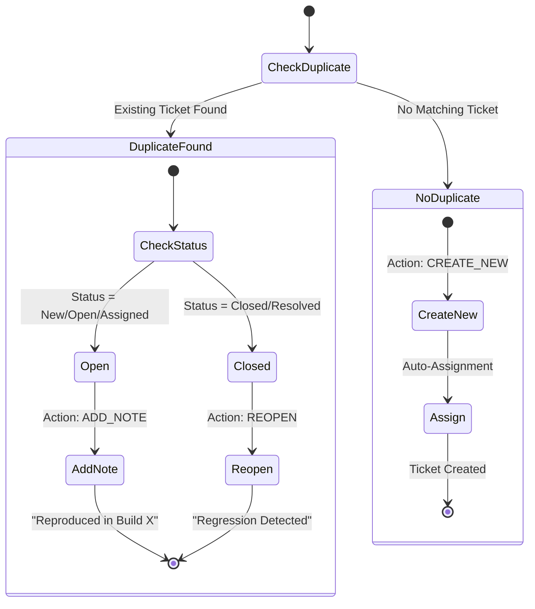

# PRD: Redmine 智慧自動提單策略 (Smart Redmine Automation Strategy)

> **Version**: 2.0 (Updated 2026-01-20)
> **Status**: Live / Production

## 1. 核心理念 (Core Philosophy)

站在 BSP Tech Leader 的角度，自動化提單系統成功的關鍵在於**「降噪 (Noise Reduction)」**與**「精準 (Accuracy)」**。系統不應成為製造垃圾工單 (Spam) 的機器，而應成為協助 RD 快速定位問題的助手。

**核心原則：Cluster-First Strategy (叢集優先)**
*   **禁止**針對單一 Test Case Failure 提單。
*   **必須**基於 AI 分析後的 Cluster 進行提單。
*   **目標**：1 個 Root Cause = 1 張 Redmine Ticket。

---

## 2. 提單策略：以模組為中心 (Module-Centric Filing)

為了解決 "Root Cause 跨模組" 與 "團隊分工以模組為界" 的矛盾，本 PRD 採用 **「強制拆分 (Strict Module Splitting)」** 策略。

### 2.1 策略邏輯
即使 AI 發現一個 Cluster (例如 #5: "Audio Buffer Underrun") 橫跨多個模組 (例如 `CtsMedia` 和 `CtsTelecom`)，系統在提單時**強制拆分**為多張工單。

*   **Cluster #5 (Root Cause: Audio Buffer)**
    *   Ticket A: `[GMS][CtsMedia] Audio Buffer Underrun` -> Assign to Audio Team
    *   Ticket B: `[GMS][CtsTelecom] Audio Buffer Underrun` -> Assign to Telecom Team

**理由**:
1.  **組織權責一致**: 避免跨部門推諉 (Ping-pong)。
2.  **UI 一致性**: 確保 Module View 中的所有工單都屬於該 Module。

### 2.2 多重 Cluster 顯示 (Multi-Cluster Representation)
當單一 Module 包含多個不同的 Cluster 時，UI 應呈現階層結構。

```text
▼ CtsMediaTestCases (Module Card)                [Total: 45 Failures]  [P0]
  |
  |-- ■ Ticket A: AudioTrack Buffer Underrun     [30 Failures]  [High]  (Cluster #5)
  |     (Status: New | Assign: Audio Team)
  |
  |-- ■ Ticket B: MediaCodec Decode Error        [15 Failures]  [Medium] (Cluster #12)
        (Status: Resolved | Assign: Video Team)
```

**顯示邏輯**:
*   **Module Card**: 聚合顯示該 Module 下所有 Cluster 的失敗總和及最高 Severity。
*   **Cluster Row**: 顯示該 Cluster 在此 Module 內的局部失敗數 (Local Fail count)。

---

## 3. 智慧工作流 (Smart Workflow)

系統已實作「智慧去重 (Smart Deduplication)」與「生命週期管理」。

### 3.1 狀態機流程圖



### 3.2 去重邏輯 (Deduplication Logic)
實作於 `DeduplicationService` class：

1.  **Check 1: Database Link**: 先檢查資料庫中該 Cluster 是否已有 `redmine_issue_id`。
2.  **Check 2: Subject Search**: 若無，則使用 `Module Name` + `AI Summary` 前 50 字元作為 Search Key，搜尋 Redmine 中標題相似的工單。
3.  **Action Determination**:
    *   若找到 **Open** 工單 -> **ADD_NOTE** (累積證據，降噪)。
    *   若找到 **Closed** 工單 -> **REOPEN** (抓出 Regression)。
    *   若無 -> **CREATE_NEW** (正常提單)。

---

## 4. 工單內容標準 (Ticket Template)

所有自動/半自動建立的工單遵循以下格式 (`RedmineClient.generate_issue_content`)：

### 4.1 標題格式 (Subject)
```text
[GMS][<Android_Version>][<Module_Name>] <AI_Summary_Title>
```

### 4.2 內容格式 (Description)
使用 Markdown 格式，自動填入 AI 分析結果與代表性 Log。

```markdown
### AI Analysis

**Root Cause**
> <AI_Root_Cause>

**Suggestion**
> <AI_Solution>

**Impact Analysis**
* **Severity**: High
* **Impact**: 45 test(s) failed (Cluster ID: #123)

---

### Environment

* **Product**: T70
* **Build ID**: T70_20260120_User
* **Fingerprint**: google/pixel/t70...
* **Suite Version**: 14_r3

---

### Technical Details

**Stack Trace Signature**
```text
a1b2c3d4
```

**Representative Stack Trace**
```java
java.lang.AssertionError: Expected true but was false
    at android.media.cts.AudioTrackTest.testPlay(AudioTrackTest.java:123)
    ...
```

### Affected Tests (Top 50)
1. [android.media.cts.AudioTrackTest#testPlay](http://gms-helper/test-case/1)
2. ...
```

---

## 5. 自動分派矩陣 (Assignment Matrix)

實作於 `AssignmentResolver` class，讀取 `config/module_owner_map.json` 進行分派。

**邏輯**:
1.  **Pattern Match**: 檢查 Module Name 是否符合 `CtsMedia*` 等 Pattern。
2.  **Severity Map**: 根據 AI Severity ("High", "Medium") 決定 Priority ID (5, 4)。
3.  **Project**: 使用 Default Project ID (設定檔定義)。

| Module Pattern | Target (Abstract) | Priority (High/Med) |
| :--- | :--- | :--- |
| `CtsMedia*` | User ID: 10 (Audio Lead) | 5 / 4 |
| `CtsCamera*` | User ID: 12 (Camera Lead)| 5 / 4 |
| `*` (Default) | User ID: 5 (System QA) | 4 / 3 |

---

## 6. 風險控管 (Risk Management)

| 風險 | 緩解措施 | 實作狀態 |
| :--- | :--- | :--- |
| **Notification Spam** | 優先使用 ADD_NOTE 而非開新單。 | ✅ 已實作 (DeduplicationService) |
| **False Positives** | 提供 `/preview` API 讓前端先預覽再送出。 | ✅ 已實作 (SmartPreviewRequest) |
| **Race Condition** | 在 Bulk Create 迴圈中二次檢查 DB lock 狀態。 | ✅ 已實作 |
